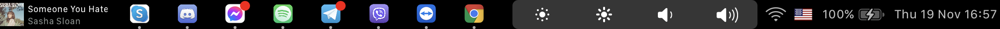
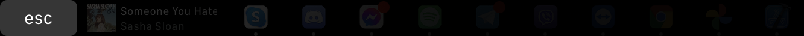
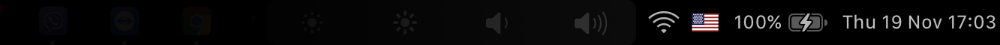
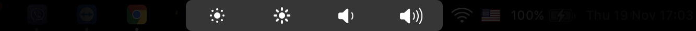
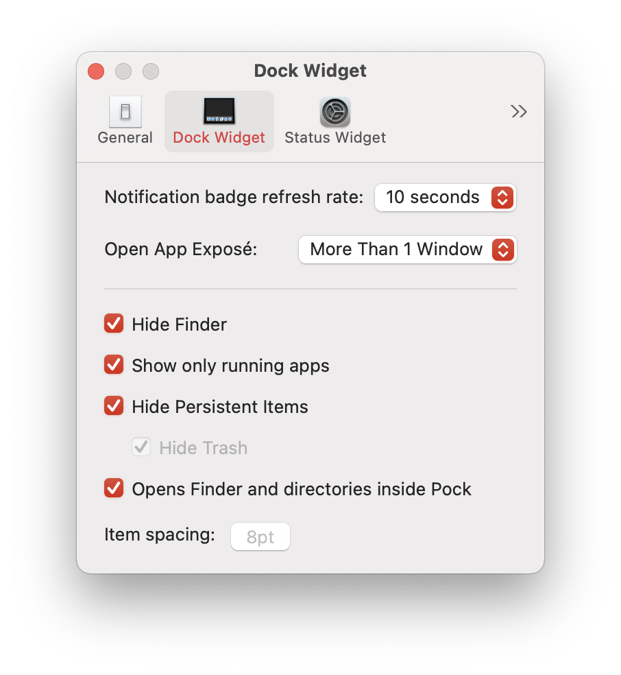
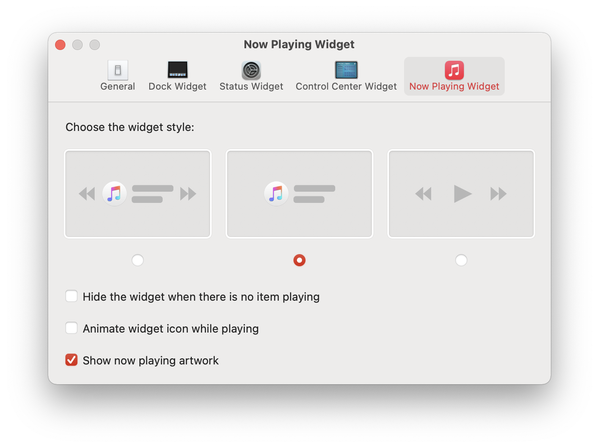
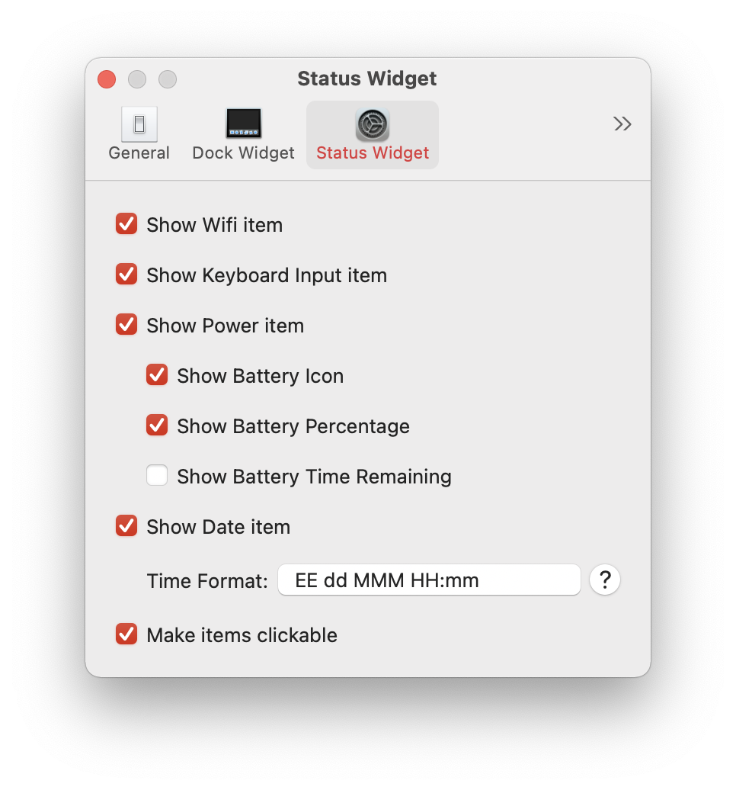
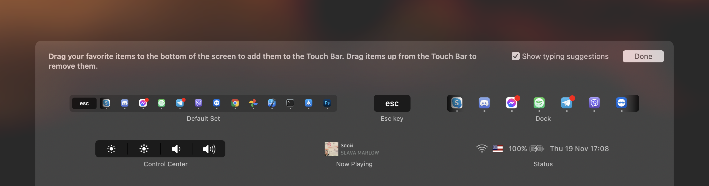

Display macOS Dock in Touch Bar.

It's free and open source, and it also brings some minimalistic widgets with it!

  

## Want something implemented - open an issue/pull request
This is mostly a personal project which started with the purchase of a TouchBar MacBook.
I am implementing everything I find beneficial or useful and yes I do like the TouchBar (despite not the default one).

## Thank you!
I don't have a support page but feel free to donate to the original author of Pock:  [Pigigaldi](https://paypal.me/pigigaldi)!

## How To Enable
1. Unzip
2. Move Pock to your Applications folder
3. Open Pock
4. Accept
5. If you don't see Pock in your Touch Bar, go to the `Keyboard` pane in System Preferences and select "Touch Bar shows _App Controls_."

## Issue resolving
If some Control Center widgets (e.g. volume up/down) don't work, please remove the app from Accessability and Screen Recording in System Preferemces and add it again.
If it still doesn't work, remove the app from Applications, reset all premissions by running `sudo tccutil reset All` in the Terminal, restart, add it again and grant the needed Accessability and Screen Recording permissions again.

## Widgets

<small>Includes five default widgets</small>

##### Dock widget

Your macOS Dock inside your MacBook's TouchBar, the core widget.
It comes with fully-functional badge support so you will not miss any notification.
More features can be configured in widget settings along with other preferences.
It now includes multi-window support!
*Enjoy your screen in full-size every time!*

  

  

##### Now Playing widget

Media information at a glance with gestures for media controls included.

| Gesture     | Action            |
| ----------- | ----------------- |
| tap         | toggle play/pause |
| swipe left  | previous song     |
| swipe right | next song         |

  

##### ESC widget

A handy ESC button is there, just in case, so you don't have to hide Pock to access the system one.

  

##### Status widget

Always keep an eye on system information, like what time is it, or maybe WiFi status or Battery status. Configure Status items from settings.
Tap to switch keyboard input, open calendar, battery overview, long click the battery to switch between percentages and time remaining.

  

##### Control Center widget

Change screen brightness or system volume with easy controls.
Long press or slide on control center item to invoke sliders.

  

##### More...

More widgets may be added, open an issue/pull request or wait for me to come up with something!

## Preferences

You can adjust Pock and widgets settings to reflects your specific needs. You can access these panes from the **Preferences** menu item.

  
  
  

## Customize

You can customize the widget position in TouchBar from the **Customize** menu item.

  

## Special mentions

From Me:
* [Apple Juice](https://github.com/raphaelhanneken/apple-juice)
* [Music Bar](https://github.com/musa11971/Music-Bar)
* [Kawa](https://github.com/utatti/kawa)

From Pigigaldi:
* [Pigigaldi](https://github.com/pigigaldi/Pock)
* [BrokenSt0rm](https://twitter.com/BrokenSt0rm) 🙅‍♂️
* [SnapKit](https://github.com/SnapKit/SnapKit)
* [Magnet, LoginServiceKit](https://github.com/Clipy)
* [touch-baer](https://github.com/a2/touch-baer) - How to put icon in Control Strip
* [Minebomber](https://stackoverflow.com/a/36115210) - This comment blowed my mind
* [Defaults, Preferences](https://github.com/sindresorhus/)
* [Witness](https://github.com/njdehoog/Witness)

## Translated READMEs (mostly from Pigigaldi's Pock)

🇺🇸 [English](README.md)
🇨🇳 [中文](.github/readmes/README.cn.md)
🇯🇵 [日本語](.github/readmes/README.ja.md)
🇹🇷 [Türkçe](.github/readmes/README.tr.md)

<small>* Some translations may be different or incomplete</small>.

## License

Under MIT license. See [LICENSE](LICENSE) file for further information.
